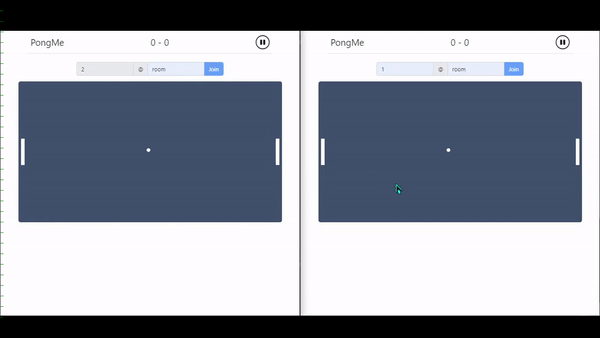

## PongMe

Online multiplayer pong game using socket.io.




## Local testing

- With docker
  ```bash
  docker build -t pongme .
  docker run -p8080:8080 pongme
  ```

- With NodeJS (v16.14.0 was used)
  ```bash
  nvm install
  nvm use
  npm install
  npm run dev
  ```


## Contribution

Feel free to contribute by opening a pull request, suggest a feature or report a bug by creating an issue.


## License

The source code for the site is licensed under the MIT license, which you can find in the LICENSE file.
